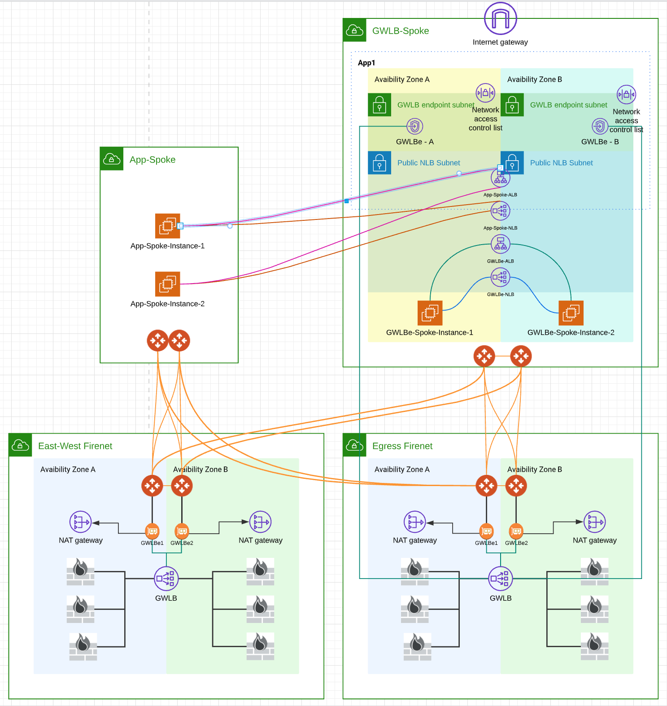

## Prerequsits
Linux

Terraform

AWS CLI

Following environment variables need to be set
```bash
# environment variables
export AVIATRIX_CONTROLLER_IP='xx.xx.xx.xx'
export AVIATRIX_PASSWORD='***********'
export AVIATRIX_USERNAME='admin'
export AWS_ACCESS_KEY_ID='AK**************'
export AWS_SECRET_ACCESS_KEY='************************'
```

## Tested environment:
```bash
$ terraform --version

Terraform v1.0.11 on linux_amd64
+ provider registry.terraform.io/aviatrixsystems/aviatrix v2.21.1-6.6.ga
+ provider registry.terraform.io/hashicorp/aws v3.74.3
+ provider registry.terraform.io/hashicorp/http v2.1.0
+ provider registry.terraform.io/hashicorp/null v3.1.0
+ provider registry.terraform.io/hashicorp/random v3.1.0
```

```bash
$ aws --version
**aws-cli/2.3.2** Python/3.8.8 Linux/5.10.60.1-microsoft-standard-WSL2 exe/x86_64.ubuntu.20 prompt/off
```

## Technical challenges
1. Aviatrix Firenet module currently doesn't return Gateway Load Balancer's Service Name
    * as such a bash script **get_vpce_service_name_from_fw_lan.sh** is called to translate:
    * Firewall LAN ENI -> Firewall LAN Subnet -> Asscoaited GWLB -> Associated VPC Endpoint Service -> VPC Endpoint Service Name
2. **module.app_spoke.vpc.public_subnets** count cannot be obtained during intial apply, workaround is to use bash wrapper **tfapply.sh** , which creates the application spoke, then copy app-spoke-instances.tf.2ndstage and app-spoke-load-balancers.tf.2ndstage to app-spoke-instances.tf and app-spoke-load-balancers.tf, then apply again


## How to run
1. Modify **variables.tf** provide account and key_pair_name
2. Run **tfapply.sh**
3. Configure the egress transit firenet Palo Altos by following these steps
    
    https://docs.aviatrix.com/HowTos/transit_firenet_workflow_aws_gwlb.html?highlight=gwlb#palo-alto-network-pan 

    * Step 3 can be skipped, as no need to active license
    * Step 4 can be skipped, as Firewall is configured as one-armed mode, there's no WAN port
    * Step 6 can be skipped, as again Firewall is one-armed mode, there's no need for route table changes
4. East West transit Firenet firewalls not need to be configured for ingress, but it's there for additional E/W tranffic filtering.


## Environment created
* GWLB enabled Egress Transit Firenet
* GWLB enabled East-West Transit Firenet
* GWLBe-Spoke VPC
    * IGW & Edge Route
    * GWLBe subnets and Route Tables
    * Load Balancer subnets and Route Tables
    * GWLB endpoint from GWLB Transit Firenet GWLB
    * GWLBe-Spoke local App Subnets
    * GWLBe-Spoke local test Web Servers
    * GWLBe-spoke local ALB/NLB pointing to local test Web Servers
    * Spoke GWs and attach to both Transit Firenet
* App-Spoke VPC
    * Spoke GWs and attach to both Transit Firenet
    * App-Spoke test web servers
    * ALB/NLB (Located in GWLBe-Spoke VPC load balancer subnets) pointing to App-Spoke test web servers


